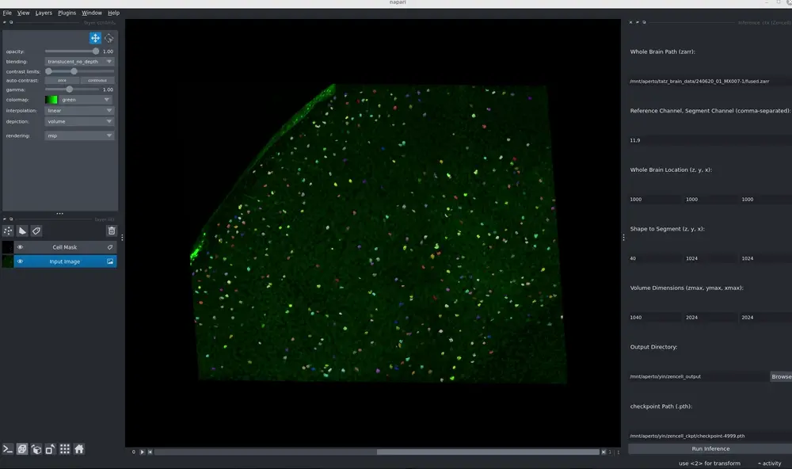
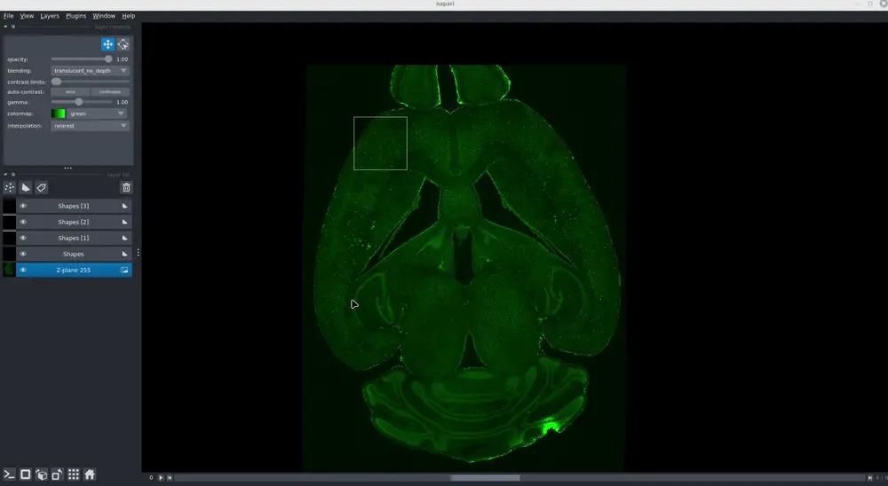

# Zencell plugin in napari


[](https://github.com/yin-n/zencell/raw/main/LICENSE)
[](https://pypi.org/project/zencell)
[](https://python.org)
[](https://github.com/yin-n/zencell/actions)
[](https://codecov.io/gh/yin-n/zencell)
[](https://napari-hub.org/plugins/zencell)
[](https://napari.org/stable/plugins/index.html)
[](https://github.com/copier-org/copier)

Plugin using Zencell model to make 3D prediction for brain cells

----------------------------------

This [napari] plugin was generated with [copier] using the [napari-plugin-template].

<!--
Don't miss the full getting started guide to set up your new package:
https://github.com/napari/napari-plugin-template#getting-started

and review the napari docs for plugin developers:
https://napari.org/stable/plugins/index.html
-->

## Installation

### environment

```
conda create -y --name zencell python=3.12

conda activate zencell

# this torch install depends on your GPU/CUDA version

pip3 install torch torchvision torchaudio --index-url https://download.pytorch.org/whl/cu126

pip install timm

pip install numba

pip install zarr

pip install opencv-python

pip install fastremap


python -m pip install "napari[all]"
```

### clone this github repository

```
git clone https://github.com/yin-n/zencell.git

```

### Install this plugin in edit mode

```
cd zencell
pip install -e .

```
## Usage

```
e.g.

whole brain path: /mnt/aperto/tatz_brain_data/240620_01_MX007-1/fused.zarr

channels: 3,2

z, y, x(start): 1000 1000 1000

block size: 40 1024 1024

z, y, x(end):1040 2024 2024

output path: /mnt/aperto/yin/zencell_output

model checkpoints path: /mnt/aperto/yin/zencell_ckpt/checkpoint-4999.pth


```
## Visualization



#### It will also have a whole brain view with a square show the area our model predicted in whole brain





####  TODO 
Implement install `zencell_plugin` via [pip].


## Contributing

Contributions are very welcome. Tests can be run with [tox], please ensure
the coverage at least stays the same before you submit a pull request.

## License

Distributed under the terms of the [BSD-3] license,
"zencell" is free and open source software

## Issues

If you encounter any problems, please [file an issue] along with a detailed description.

[napari]: https://github.com/napari/napari
[copier]: https://copier.readthedocs.io/en/stable/
[@napari]: https://github.com/napari
[MIT]: http://opensource.org/licenses/MIT
[BSD-3]: http://opensource.org/licenses/BSD-3-Clause
[GNU GPL v3.0]: http://www.gnu.org/licenses/gpl-3.0.txt
[GNU LGPL v3.0]: http://www.gnu.org/licenses/lgpl-3.0.txt
[Apache Software License 2.0]: http://www.apache.org/licenses/LICENSE-2.0
[Mozilla Public License 2.0]: https://www.mozilla.org/media/MPL/2.0/index.txt
[napari-plugin-template]: https://github.com/napari/napari-plugin-template

[napari]: https://github.com/napari/napari
[tox]: https://tox.readthedocs.io/en/latest/
[pip]: https://pypi.org/project/pip/
[PyPI]: https://pypi.org/
